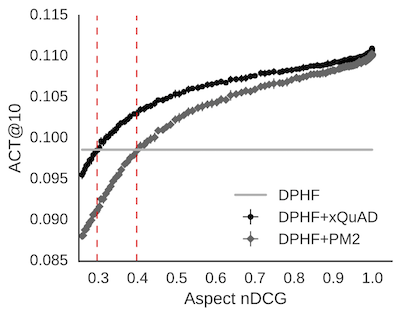

Research on exploratory search has been supported by several initiatives. The **T**ext **RE**trieval **C**onference (TREC) has hosted related research tracks on [interactive](http://trec.nist.gov/data/interactive.html) search, search within [sessions](http://trec.nist.gov/data/session.html), search for [task completion](http://trec.nist.gov/data/tasks.html) and, more recently, dynamic search in specialized domains. The latter problem, embodied by the [TREC Dynamic Domain (DD)](http://trec-dd.org/) track, was the focus of my Master's thesis, supervised by [Rodrygo Santos](http://homepages.dcc.ufmg.br/~rodrygo/). As a result of this work, we got a full paper accepted at ICTIR 2017.

```bibtex
@inproceedings{moraes2017ictir-a,
  author = {Felipe Moraes and Rodrygo L. T. Santos and Nivio Ziviani},
  title = {On Effective Dynamic Search in Specialized Domains},
  booktitle = {Proceedings of the 3rd ACM International Conference on the 
    Theory of Information Retrieval},
  year = {2017},
  address = {Amsterdam, The Netherlands}
}
```

The TREC DD track has been organized by [Grace Hui Yang](http://infosense.cs.georgetown.edu/grace/) and [Ian Soboroff](https://www.nist.gov/people/ian-soboroff). In this track, the main task is summarized as follows: 

_Given an initial query, a dynamic search system must improve its understanding of the user’s information need through a series of interactions. In each interaction, the user may provide the system with feedback on the relevance of specific passages of the retrieved documents with respect to one or more aspects underlying his or her information need. The system must then choose to either provide the user with further documents or end the interactive process. An effective system should be able to satisfy as many query aspects as possible (**to maximize user satisfaction**) with as few interactions as possible (**to minimize user effort**)._


A dynamic search system must cope with four key problems: 

1. produce an initial sample of candidate documents given the user’s query and the domain of interest; 
2. decide whether the user’s information need has been satisfied and eventually stop the interactive process; 
3. leverage the user’s feedback to learn an improved aspect model;
4. produce an enhanced ranking given the learned aspect model.


In the beginning of my Master's, we tackled this problem as a participant group of the TREC DD 2016. In total, we submitted five runs with different approaches, and in our notebook paper [UFMG at the TREC 2016 Dynamic Domain track](http://trec.nist.gov/pubs/trec25/papers/ufmg-DD.pdf), we presented results for additional unofficial runs.

After our participation, we noticed that even the reportedly most effective system in each of the five domains of interest have shown only marginal improvements compared to vanilla ad-hoc search baselines, which leverage no user feedback, as shown in the plots below:

Ebola domain            |  Polar domain
:-------------------------:|:-------------------------:
  |   

Then, our objective turned to understanding the challenges involved in building effective dynamic search systems. To this end, we isolated each of the aforementioned problems as a separate component of a dynamic search system as shown in the figure below:


:-------------------------:|
  |  
Flow diagram of a typical dynamic search system            |  

To study the impact of each of these components, we experimented with the following instantiations:

- Baseline ranker: we generated a variety of candidate samples **R** by perturbing a reference ranking produced by a field-based weighting model. In particular, we use a field-based extension of [DPH](https://art.torvergata.it/retrieve/handle/2108/33648/85364/trec2008.pdf) (henceforth “DPHF”). You can find my implementation of DPH for Lucene [here](https://github.com/felipemoraes/DPH-for-Lucene).
- Aspect modeling: we represented each aspect **a** as an aggregate of the relevant passages associated with it, with the content of each passage **p** weighted by its corresponding relevance grade **g**. 
- Dynamic reranker:  we took two state-of-the-art diversification models: [xQuAD](http://dl.acm.org/citation.cfm?id=1772780) and [PM2](http://dl.acm.org/citation.cfm?id=2348296). In line with the goal of dynamic search, these models attempt to satisfy as many query aspects as possible (**promoting diversity**) and as early as possible (**promoting novelty**).

We have four research questions in this paper:

- **Q1**. How does the initial document sample impact the effectiveness of a dynamic search system?
- **Q2**. What is the impact of feedback modeling on the system's knowledge of the aspects underlying the user's query?
- **Q3**. How do improved coverage estimates impact the system's ability to dynamically adapt its ranking strategy?
- **Q4**. What is the impact of early and late stopping strategies on the attained gain-effort trade-off?

In the remainder of this post, I willl summarise our findings for each of the first three questions in turn. Our observations are based on [ACT](http://dl.acm.org/citation.cfm?id=2523648) figures averaged across 171 queries from all five domains of the TREC 2015-2016 Dynamic Domain.

### Q1. Baseline ranker

 The baseline ranker component may impact the efectiveness of a dynamic search system in different moments. In particular, to address **Q1**, we investigated two complementary hypotheses:

> **H1**. At earlier interactions, the effectiveness of the system is influenced by the precision attained by the baseline ranker.

> **H2**. At later interactions, the effectiveness of the system is influenced by the recall attained by the baseline ranker.


### Q2. Aspect Modeling

To address **Q2**, we analyzed the contribution of an accurate modeling of the multiple aspects **A** underlying the user’s need based upon the feedback **F** provided by the user at each time **t**. We propose the following hypothesis:

> **H3**. The effectiveness of a dynamic search system can be hindered by an inaccurate or incomplete aspect modeling.

We performed two different simulations, one mishandling feedback on individual passages, and other mishandling aspects. The figures below show the impact on dynamic search effectiveness in terms of ACT@10 for DPHF, DPHF+xQuAD, and DPHF+PM2 as we increase the probability of perturbing the underlying aspect model:


:-------------------------:|:-------------------------:
<p>  </p>
Inaccurate aspect modeling            |  Incomplete aspect modeling


From the figures, we note that, as we increase either the probability of mishandling feedback on individual passages or the fraction of mishandled aspects, dynamic search effectiveness is hindered, which answers **Q2** by providing supporting evidence for **H3**. On the other hand, these results demonstrate a reasonable resilience of both xQuAD and PM2 to inaccurate or incomplete aspect models.

### Q3. Dynamic Reranker

To address **Q3**, we proposed the following hypothesis:

> **H4**. The effectiveness of a dynamic search system can be enhanced by improved document coverage estimates for a given aspect model, more so for narrower queries.

proposed the above hypothesis because coverage estimates are key in a dynamic search scenario, particularly for narrower queries, which have a smaller number of relevant aspects and hence are arguably harder to diversify. To test this hypothesis, we simulate increasingly inaccurate coverage estimates, by gradually adding noise to the perfect estimates given by the ground truth data. 

In the figure below, we first note that DHF+xQuAD and DPHF+PM2 increasingly outperform the DPHF baseline ranker as their underlying coverage estimates improve, in support of **H4**. In particular, xQuAD begins to outperform DPHF at a critical leakage (CL) point of **0.3**, measured in terms of aspect nDCG. On the other hand, PM2 requires slightly improved coverage estimates at a CL point of **0.4**.


:-------------------------:|
  |  
Impact of perturbed coverage estimates.            |  


### Take-home messages:

Briefly, we described several properties that dynamic search systems must cope with:

- A high-precision baseline ranker may improve dynamic search at early interactions, whereas a high-recall baseline ranker tends to favor later interactions. 
- Mishandling the user’s feedback on individual passages associated with an aspect or on entire aspects may lead to decreased effectiveness. 
- There is a need for accurately estimating the coverage of each retrieved document with respect to each query aspect, particularly for queries with fewer aspects, which seem inherently harder to improve. 
- Early stopping strategies achieve a better gain-effort trade-off compared to late stopping strategies, which highlights the challenge of promoting effective exploration in this task.

For more details about the results and analysis, stay tuned for our pre-print, or check out an extended version of the paper in my [Master's thesis](https://www.dcc.ufmg.br/pos/cursos/defesas/2069M.PDF). Or better, see you in Amsterdam in my presentation! Dank u wel en tot ziens!
